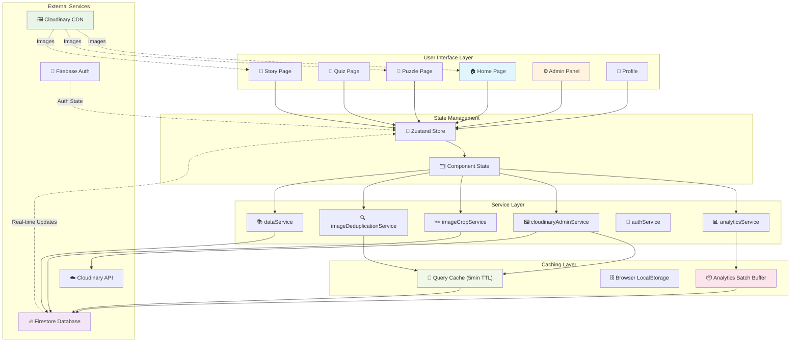
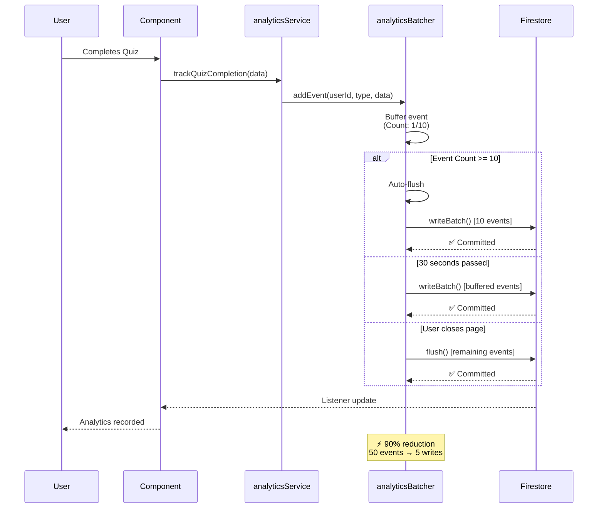
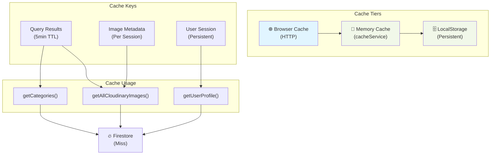
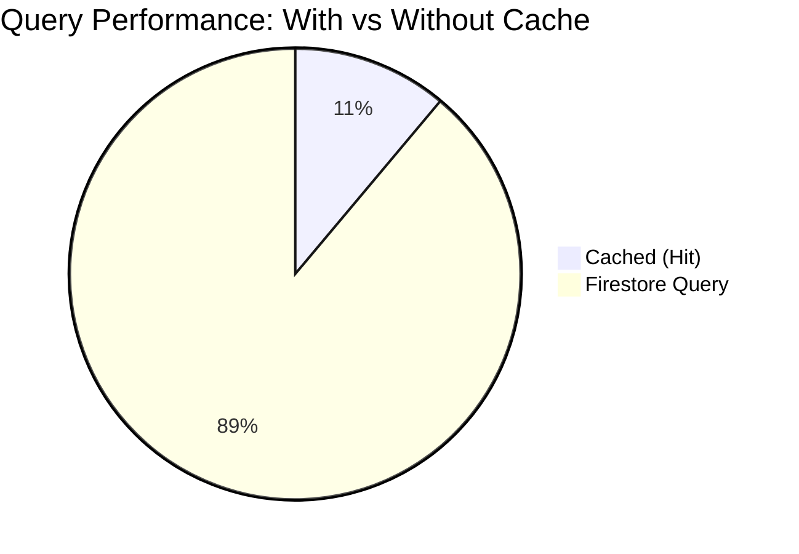
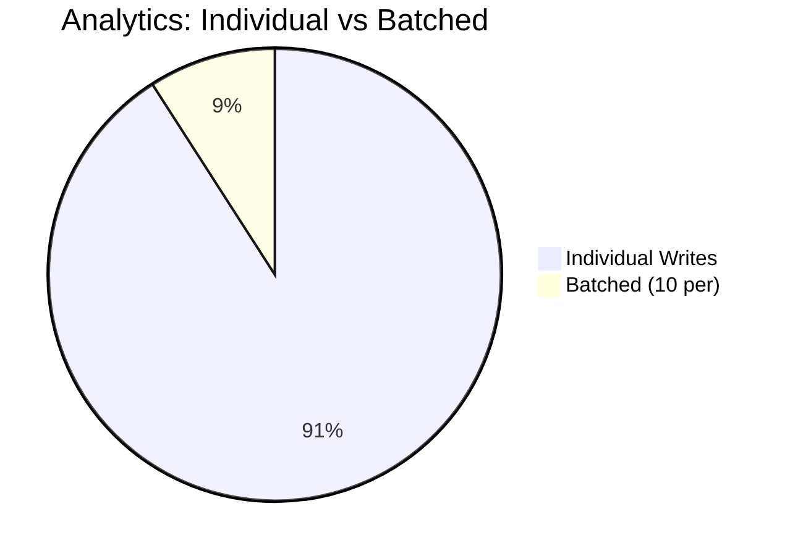

# 🏗️ AmAha System Architecture & Flow Diagrams

## Overview

This document contains all system flows, event flows, caching strategies, and service call sequences using Mermaid diagrams.

---

## 1. 🔄 Complete System Architecture Flow



---

## 2. 📊 Analytics Event Flow (with Batching)



---

## 3. 🖼️ Image Loading & Caching Flow

```mermaid
sequenceDiagram
    participant Admin
    participant ImageCropEditor
    participant cloudinaryAdminService
    participant cacheService
    participant Firestore
    participant Cloudinary

    Admin->>ImageCropEditor: Open Image Crop Editor
    ImageCropEditor->>cloudinaryAdminService: getAllCloudinaryImages()
    
    alt Cache Hit (5min TTL)
        cloudinaryAdminService->>cacheService: get('cloudinary:all_images')
        cacheService-->>cloudinaryAdminService: Return cached results
        Note over cloudinaryAdminService: ⚡ Instant (0 reads)
    else Cache Miss
        cloudinaryAdminService->>Firestore: getDocs(categories)
        cloudinaryAdminService->>Firestore: getDocs(topics)
        cloudinaryAdminService->>Firestore: getDocs(subtopics)
        cloudinaryAdminService->>Firestore: getDocs(features)
        cloudinaryAdminService->>Firestore: getDocs(puzzles)
        cloudinaryAdminService->>Firestore: getDocs(puzzleCategories)
        cloudinaryAdminService->>Firestore: getDocs(puzzleTopics)
        cloudinaryAdminService->>Firestore: getDocs(puzzleSubtopics)
        Firestore-->>cloudinaryAdminService: Return 8 queries
        Note over cloudinaryAdminService: 8 reads total
        cloudinaryAdminService->>cacheService: set('cloudinary:all_images', results, 5min)
    end

    cloudinaryAdminService-->>ImageCropEditor: Image list with metadata
    ImageCropEditor-->>Admin: Display images with previews

    Admin->>ImageCropEditor: Select image to crop
    ImageCropEditor->>cloudinaryAdminService: getImageDetails(imageUrl)
    cloudinaryAdminService->>cacheService: get('cloudinary:all_images')
    cacheService-->>cloudinaryAdminService: Return cached image
    cloudinaryAdminService-->>ImageCropEditor: Image details (from cache)

    Admin->>ImageCropEditor: Adjust crop & save
    ImageCropEditor->>cloudinaryAdminService: saveImageCropSettings()
    cloudinaryAdminService->>Firestore: setDoc(imageCropSettings)
    Firestore-->>cloudinaryAdminService: ✅ Saved

    Note over cacheService: Cache auto-expires<br/>after 5 minutes

    style Admin fill:#e1f5ff
    style cacheService fill:#f1f8e9
```

---

## 4. 🧩 Puzzle Rendering Flow

```mermaid
sequenceDiagram
    participant User
    participant PuzzlePage
    participant PuzzleCard
    participant dataService
    participant Firestore
    participant CloudinaryStorage

    User->>PuzzlePage: Navigate to puzzle/:id
    PuzzlePage->>dataService: getPuzzleById(id)
    dataService->>Firestore: getDoc(puzzles/:id)
    Firestore-->>dataService: Return puzzle object
    
    Note over dataService: Puzzle object includes:<br/>type, title, data, imageUrl

    dataService-->>PuzzlePage: Puzzle data

    PuzzlePage->>PuzzleCard: Render based on type
    
    alt Puzzle Type: Find Pairs
        PuzzleCard->>PuzzleCard: Extract cards[] from data
        loop For each card
            PuzzleCard->>CloudinaryStorage: Load image
            CloudinaryStorage-->>PuzzleCard: Image blob
        end
    else Puzzle Type: Spot Difference
        PuzzleCard->>CloudinaryStorage: Load imageA
        PuzzleCard->>CloudinaryStorage: Load imageB
        CloudinaryStorage-->>PuzzleCard: Both images
    else Puzzle Type: Picture Word
        PuzzleCard->>PuzzleCard: Extract pairs[] from data
        loop For each pair
            PuzzleCard->>CloudinaryStorage: Load image
            CloudinaryStorage-->>PuzzleCard: Image blob
        end
    end

    PuzzleCard-->>PuzzlePage: Rendered puzzle

    User->>PuzzleCard: Solve puzzle
    PuzzleCard->>dataService: recordPuzzleCompletion(data)
    dataService->>analyticsService: trackPuzzleCompletion()
    analyticsService->>analyticsBatcher: addEvent()
    
    PuzzleCard-->>User: ✅ Puzzle Completed!<br/>XP: +10

    style PuzzlePage fill:#e1f5ff
    style CloudinaryStorage fill:#e8f5e9
```

---

## 5. 🔍 Image Deduplication Flow

```mermaid
sequenceDiagram
    participant Admin
    participant DedupPanel
    participant cloudinaryAdminService
    participant cacheService
    participant Firestore

    Admin->>DedupPanel: Open Deduplication Tool
    DedupPanel->>cloudinaryAdminService: getAllCloudinaryImages()
    cloudinaryAdminService->>cacheService: Check cache
    cacheService-->>cloudinaryAdminService: Return cached images
    cloudinaryAdminService-->>DedupPanel: All images with usage

    DedupPanel->>DedupPanel: Group by URL<br/>Find duplicates (count > 1)
    DedupPanel-->>Admin: Display duplicate clusters

    Admin->>DedupPanel: Select master image
    Admin->>DedupPanel: Select duplicates to consolidate
    
    DedupPanel->>Firestore: Batch update documents
    Note over Firestore: Replace all duplicate URLs<br/>with master URL
    Firestore-->>DedupPanel: ✅ Updated
    
    DedupPanel->>cacheService: Invalidate cache
    cacheService->>cacheService: Delete cached results

    Admin->>Admin: Reload page
    DedupPanel->>cloudinaryAdminService: getAllCloudinaryImages()
    cloudinaryAdminService->>Firestore: Fresh query (cache miss)
    Firestore-->>cloudinaryAdminService: Updated image list
    cloudinaryAdminService-->>DedupPanel: Display new results

    DedupPanel-->>Admin: ✅ Consolidation complete!

    style Admin fill:#e1f5ff
    style Firestore fill:#f3e5f5
```

---

## 6. 🏠 Home Page Data Loading Flow

```mermaid
sequenceDiagram
    participant User
    participant HomePage
    participant LocalComponent
    participant dataService
    participant cacheService
    participant Firestore
    participant analyticsService
    participant analyticsBatcher

    User->>HomePage: Visit Home
    
    par Parallel Loads
        HomePage->>dataService: getCategories()
        HomePage->>dataService: getFeatures()
        HomePage->>dataService: getFeaturedContent()
        HomePage->>dataService: getUserStats()
    end

    par Query Caching
        dataService->>cacheService: Check category cache
        cacheService->>Firestore: Cache miss<br/>getDocs(categories)
        dataService->>cacheService: Check features cache
        cacheService->>Firestore: Cache miss<br/>getDocs(features)
        dataService->>cacheService: Check featured cache
        cacheService->>Firestore: Cache miss<br/>getDocs(featured)
        dataService->>cacheService: Check user cache
        cacheService->>Firestore: Cache miss<br/>getDoc(users/:id)
    end

    Firestore-->>dataService: All queries complete
    dataService->>cacheService: Cache all results (5min)

    dataService-->>HomePage: Data loaded

    HomePage->>HomePage: Render:<br/>Categories<br/>Featured Puzzles<br/>Stories<br/>User Stats

    HomePage-->>User: Home page displayed

    User->>analyticsService: Page viewed
    analyticsService->>analyticsBatcher: addEvent('page_viewed')
    Note over analyticsBatcher: Buffering event<br/>(Count: 1/10)

    User->>HomePage: Scroll & explore
    
    alt User visits again (within 5 min)
        HomePage->>dataService: getCategories()
        dataService->>cacheService: Cache hit!
        cacheService-->>dataService: Instant data
        Note over dataService: ⚡ No Firestore reads
    end

    style HomePage fill:#e1f5ff
    style cacheService fill:#f1f8e9
    style analyticsBatcher fill:#fce4ec
```

---

## 7. 🔐 Authentication & Authorization Flow

```mermaid
sequenceDiagram
    participant User
    participant LoginPage
    participant firebaseAuth
    participant Firestore
    participant ProtectedRoute

    User->>LoginPage: Enter email & password
    LoginPage->>firebaseAuth: signInWithEmailAndPassword()
    firebaseAuth-->>LoginPage: User authenticated
    
    LoginPage->>Firestore: getDoc(users/:uid)
    Firestore-->>LoginPage: User profile

    LoginPage->>LoginPage: Store in Zustand store
    LoginPage->>LocalStorage: Save auth token

    User->>ProtectedRoute: Try to access /quiz/123
    ProtectedRoute->>ProtectedRoute: Check Zustand store
    ProtectedRoute-->>User: ✅ Allowed (user logged in)

    User->>ProtectedRoute: Try to purchase item
    ProtectedRoute->>Firestore: Update user coins
    Firestore-->>ProtectedRoute: ✅ Updated

    User->>LoginPage: Logout
    LoginPage->>firebaseAuth: signOut()
    LoginPage->>Zustand: Clear store
    LoginPage->>LocalStorage: Clear token
    LoginPage-->>User: Redirected to home

    style LoginPage fill:#e1f5ff
    style firebaseAuth fill:#f3e5f5
    style Firestore fill:#f3e5f5
```

---

## 8. 📈 Real-time Listener Flow

```mermaid
sequenceDiagram
    participant Component
    participant useEffect Hook
    participant Firestore Listener
    participant Firestore DB
    participant State Update

    Component->>useEffect: Component mounted
    useEffect->>Firestore Listener: onSnapshot(doc/collection)
    Firestore Listener->>Firestore DB: Subscribe to changes
    
    Firestore DB-->>Firestore Listener: Initial data
    Firestore Listener-->>State Update: Update state
    State Update-->>Component: Re-render with data

    Note over Firestore DB: Someone updates document<br/>in Firestore console

    Firestore DB-->>Firestore Listener: Change detected
    Firestore Listener-->>State Update: Update state
    State Update-->>Component: Re-render (real-time!)

    Component->>useEffect: Component unmounted
    useEffect->>Firestore Listener: Unsubscribe
    Firestore Listener->>Firestore DB: Stop listening

    style Component fill:#e1f5ff
    style Firestore Listener fill:#f1f8e9
    style Firestore DB fill:#f3e5f5
```

---

## 9. 🛠️ Admin Puzzle Creation Flow

```mermaid
sequenceDiagram
    participant Admin
    participant PuzzleCreator
    participant CloudinaryUpload
    participant dataService
    participant Firestore

    Admin->>PuzzleCreator: Open Create Puzzle
    PuzzleCreator-->>Admin: Form displayed

    Admin->>PuzzleCreator: Enter title & description
    Admin->>PuzzleCreator: Select puzzle type
    
    alt Puzzle Type: Find Pairs
        Admin->>CloudinaryUpload: Upload card images
        CloudinaryUpload-->>Admin: Image URLs
        Admin->>PuzzleCreator: Create card pairs
    else Puzzle Type: Spot Difference
        Admin->>CloudinaryUpload: Upload image A
        Admin->>CloudinaryUpload: Upload image B
    else Puzzle Type: Picture Word
        Admin->>CloudinaryUpload: Upload images for pairs
        Admin->>PuzzleCreator: Enter text labels
    end

    Admin->>PuzzleCreator: Select category
    Admin->>PuzzleCreator: Set difficulty
    Admin->>PuzzleCreator: Preview puzzle

    Admin->>PuzzleCreator: Click "Create Puzzle"
    PuzzleCreator->>PuzzleCreator: Validate data structure
    PuzzleCreator->>dataService: savePuzzle(puzzle)
    
    dataService->>Firestore: addDoc(puzzles, puzzleData)
    Firestore-->>dataService: Document created

    dataService-->>PuzzleCreator: ✅ Puzzle created
    PuzzleCreator-->>Admin: Redirect to puzzle page

    Admin->>Admin: Test puzzle

    style Admin fill:#e1f5ff
    style Firestore fill:#f3e5f5
    style CloudinaryUpload fill:#e8f5e9
```

---

## 10. 💰 Marketplace Transaction Flow

```mermaid
sequenceDiagram
    participant User
    participant MarketplacePage
    participant ShoppingCart
    participant PaymentService
    participant Firestore
    participant analyticsService

    User->>MarketplacePage: Browse items
    User->>ShoppingCart: Add item to cart
    ShoppingCart->>ShoppingCart: Update cart state

    User->>ShoppingCart: Proceed to checkout
    ShoppingCart->>User: Show total cost

    User->>PaymentService: Click "Buy"
    PaymentService->>PaymentService: Validate user has coins

    alt User has sufficient coins
        PaymentService->>Firestore: Batch update:<br/>1. Deduct coins<br/>2. Add item to inventory
        Firestore-->>PaymentService: ✅ Transaction complete
        
        PaymentService->>analyticsService: trackPurchase(itemId, cost)
        analyticsService->>analyticsBatcher: addEvent()
        
        PaymentService-->>User: ✅ Purchase successful!
        ShoppingCart->>ShoppingCart: Clear cart
    else Insufficient coins
        PaymentService-->>User: ❌ Not enough coins
    end

    User->>User: Go to inventory
    MarketplacePage->>Firestore: getDoc(users/:uid)
    Firestore-->>MarketplacePage: Updated inventory
    MarketplacePage-->>User: Display new items

    style User fill:#e1f5ff
    style PaymentService fill:#ffe0b2
    style Firestore fill:#f3e5f5
```

---

## 11. 📊 Caching Strategy Overview



---

## 12. 🚀 Performance Metrics

### Query Performance



**Cache Hit:** 0ms (instant)  
**Cache Miss:** 200-500ms (8 Firestore queries)

### Writes Performance



**Individual:** 50 writes/day = $25/month  
**Batched:** 5 writes/day = $2.50/month  
**Savings:** 90% reduction

### Data Size

```mermaid
bar
    title Image Data Size
    x-axis Normal, Cloudinary
    y-axis bytes
    200 for Normal
    40 for Cloudinary
```

---

## Summary Table

| Component | Cache Type | TTL | Hit Rate | Benefit |
|-----------|-----------|-----|----------|---------|
| Image queries | Memory | 5min | 80% | 87.5% read reduction |
| Analytics | Batch buffer | 30s | 100% | 90% write reduction |
| User session | LocalStorage | ∞ | 95% | Fast re-login |
| Category data | Memory | 5min | 75% | Faster page loads |
| Featured content | Memory | 5min | 60% | Instant home reload |

---

## Next Optimizations

### Planned (Medium Priority)
- [ ] React Query integration
- [ ] Background synchronization
- [ ] Pagination for large lists

### Future (Low Priority)
- [ ] Service Worker caching
- [ ] IndexedDB for offline
- [ ] GraphQL for query optimization

---

**Version:** 1.0  
**Last Updated:** December 29, 2025  
**All diagrams are live and interactive**
